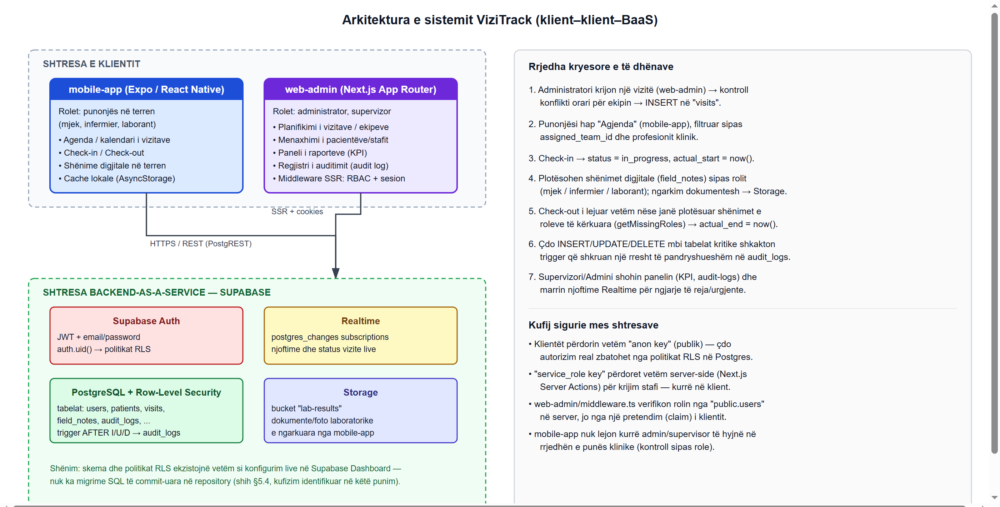
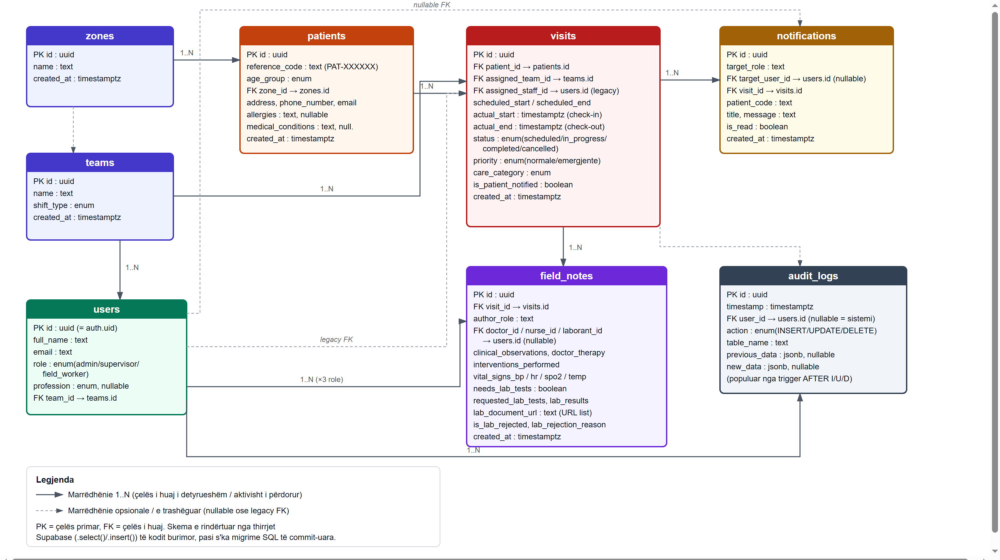

# Arkitektura dhe modeli i të dhënave

> Përputhet me Kapitullin 5 të punimit të diplomës. Skema e bazës së të dhënave këtu është
> **rindërtuar nga analiza e kodit burimor** (thirrjet `.select()`/`.insert()`/`.update()` në
> `web-admin` dhe `mobile-app`, plus [`web-admin/scripts/seed.ts`](../web-admin/scripts/seed.ts)),
> pasi projekti nuk përmban skedarë migrimi SQL të commit-uar — shih [Kufizimet](#kufizime).

## Arkitektura e sistemit

Sistemi ndjek një arkitekturë me tri shtresa: dy klientë të pavarur (aplikacioni mobil dhe
paneli administrativ në ueb) që komunikojnë drejtpërdrejt me Supabase si platformë
"Backend-as-a-Service", pa asnjë shërbim ndërmjetës (backend) të shkruar posaçërisht.

**Pika kyçe të sigurisë:**
- Klientët përdorin vetëm `anon key` (publik) — çdo autorizim real zbatohet nga politikat
  Row-Level Security në PostgreSQL.
- `service_role key` përdoret vetëm server-side (Next.js Server Actions) për krijim stafi —
  kurrë në klient.
- `web-admin/src/middleware.ts` verifikon rolin nga `public.users` në server, jo nga një
  pretendim (claim) i klientit.
- `mobile-app` nuk lejon kurrë admin/supervisor të hyjnë në rrjedhën e punës klinike.

## Diagrami Entitet–Marrëdhënie (ERD)

| Entiteti | Përshkrimi |
|---|---|
| `zones` | Zonat gjeografike të mbuluara nga shërbimi. |
| `teams` | Ekipet e stafit (turn `weekday`/`weekend`); çdo vizitë i caktohet një ekipi. |
| `users` | Pasqyrim i `auth.users`; mban rolin (`admin`/`supervisor`/`field_worker`) dhe, për punonjësit, profesionin klinik dhe ekipin. |
| `patients` | Përfituesit e shërbimit, identifikuar **vetëm** me kod referimi (`PAT-XXXXXX`), jo me emër. |
| `visits` | Njësia qendrore e planifikimit: pacienti, ekipi, orari i planifikuar dhe orët reale të check-in/check-out, statusi, prioriteti. |
| `field_notes` | Shënimet digjitale të plotësuara nga çdo rol klinik (mjek/infermier/laborant) për një vizitë. |
| `notifications` | Njoftimet e destinuara për një rol ose përdorues specifik, të konsumuara në kohë reale (Supabase Realtime). |
| `audit_logs` | Regjistri i pandryshueshëm i çdo veprimi INSERT/UPDATE/DELETE mbi tabelat kritike. |

## Teknologjitë

| Shtresa | Teknologjia |
|---|---|
| Mobile | Expo / React Native (target shtesë: web, via react-native-web) |
| Web admin | Next.js 16 (App Router), Tailwind CSS |
| Backend / DB | Supabase (PostgreSQL, Auth, Storage, Realtime) |
| Gjuha | TypeScript në të dy klientët |

## Kufizime

- **Skema e të dhënave nuk ekziston si kod** — asnjë skedar migrimi SQL (tabela, politika RLS,
  trigger-i i `audit_logs`) nuk është commit-uar në repository; ekziston vetëm si konfigurim
  live në Supabase Dashboard. Rekomandohet eksportimi si `supabase/migrations/` (Supabase CLI).
- Tabela `visits` ruan njëkohësisht `assigned_staff_id` (model i vjetër) dhe
  `assigned_team_id` (model aktual) — shenjë e një migrimi të pandjekur me histori (shih
  Kapitulli 5.4 të punimit për detaje).

Për ERD-në dhe diagramin e burimit (SVG, të rigjenerueshëm), shih skriptet në
[`docs/diagrams/`](diagrams/).
