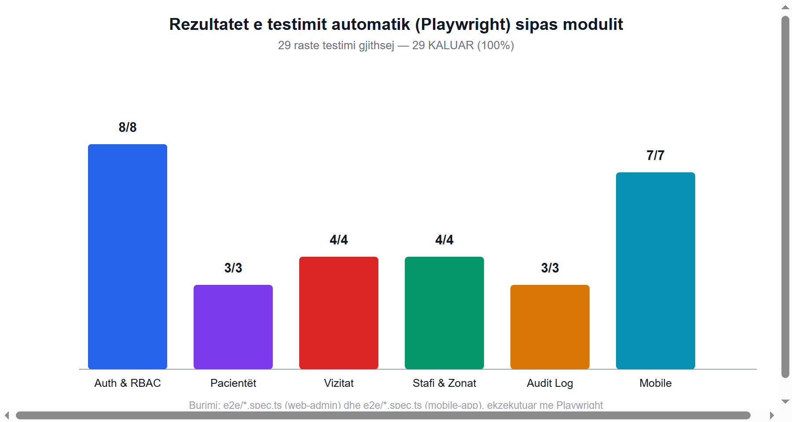
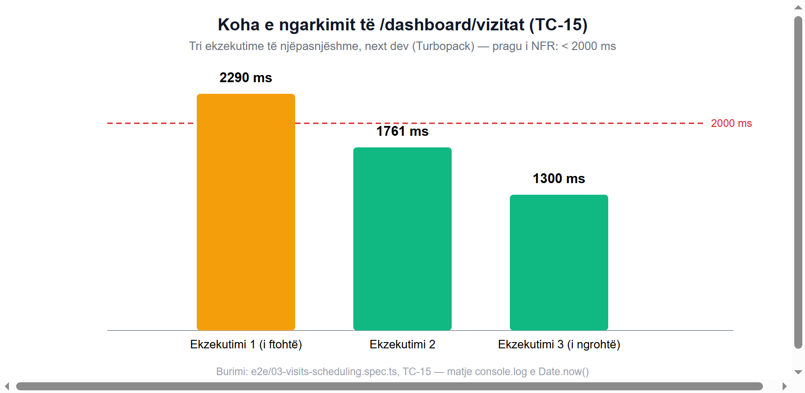

# Plan testimi, rezultatet dhe analiza

> Ky dokument përmbledh planin e testimit, rastet e testimit, rezultatet dhe analizën për
> **ViziTrack** (web-admin + mobile-app). Përputhet me Kapitullin 9 të punimit të diplomës;
> versioni i plotë me analizë të detajuar gjendet atje. Kodi burimor i testeve ndodhet te
> [`web-admin/e2e/`](../web-admin/e2e/) dhe [`mobile-app/e2e/`](../mobile-app/e2e/).

## Metodologjia

Testimi u krye në dy shtresa:

1. **Teste të automatizuara "end-to-end" (E2E)** me [Playwright](https://playwright.dev/) — 29
   raste testimi gjithsej, të ndara në 6 skedarë tematikë (5 për web-admin, 1 për mobile-app,
   i ekzekutuar kundër target-it web të Expo-s).
2. **Testim manual/eksplorues**, i dokumentuar me pamje ekrani direkt nga aplikacioni në punë
   (shih Kapitujt 6–8 të punimit të diplomës, dorëzuar veçmas si `.docx`), për rrjedha me
   ndërveprim vizual më kompleks (formulari me shumë hapa i krijimit të vizitës, formularët e
   shënimeve klinike sipas rolit).

Të gjitha testet u ekzekutuan kundër bazës reale të Supabase-it, e mbushur paraprakisht me **të
dhëna sintetike** (faker) dhe llogari testuese nën domain-in fiktiv `@demo.com` — asnjë e dhënë
reale identifikuese pacienti nuk u përdor apo u ekspozua gjatë testimit.

### Mjedisi i ekzekutimit

| Komponenti | Vlera |
|---|---|
| Motori i testimit | `@playwright/test` v1.61.1, Chromium (headless) |
| web-admin | Next.js 16.2.10 (Turbopack), `next dev`, porti 3000 |
| mobile-app | Expo SDK 57 (target web, react-native-web), Metro bundler, porti 8082 |
| Baza e të dhënave | Projekt real Supabase (PostgreSQL), me të dhëna sintetike |
| Llogaritë testuese | `admin@demo.com`, `dita@demo.com` (supervisor), `hasan/dardan/arta@demo.com` (mjek/infermier/laborant) |

Si të ekzekutosh vetë suitën:

```bash
cd web-admin && npm run test:e2e
cd mobile-app && npx playwright test   # kërkon `npm run web` të ekzekutuar paralelisht
```

## Rezultatet — përmbledhje



**29 nga 29 raste testimi KALOJNË** në gjendjen përfundimtare të kodit.

## Rastet e testimit

### web-admin (22 raste)

| ID | Skedari | Qëllimi i testit | Rezultati |
|---|---|---|---|
| TC-01 | `01-auth-rbac.spec.ts` | Admin hyn me sukses, sheh Qendrën Operacionale | KALOI |
| TC-02 | `01-auth-rbac.spec.ts` | Supervizor hyn me sukses, sheh Panelin Administrativ | KALOI |
| TC-03 | `01-auth-rbac.spec.ts` | Kredenciale të gabuara → mesazh gabimi, s'lejohet hyrje | KALOI |
| TC-04 | `01-auth-rbac.spec.ts` | I paautentikuar në `/admin` → ridrejtim te `/login` | KALOI |
| TC-05 | `01-auth-rbac.spec.ts` | I paautentikuar në `/dashboard` → ridrejtim te `/login` | KALOI |
| TC-06 | `01-auth-rbac.spec.ts` | Supervizor në `/admin` → ridrejtim te `/dashboard` (RBAC) | KALOI |
| TC-07 | `01-auth-rbac.spec.ts` | Punonjës terreni s'mund të hyjë në panelin web | KALOI |
| TC-08 | `01-auth-rbac.spec.ts` | Admin i kyçur → `/login` ridrejton te `/admin` | KALOI |
| TC-09 | `02-patients-privacy.spec.ts` | Lista e pacientëve identifikon vetëm me kod referimi | KALOI |
| TC-10 | `02-patients-privacy.spec.ts` | Filtrimi i pacientëve sipas zonës funksionon | KALOI |
| TC-11 | `02-patients-privacy.spec.ts` | Historiku i pacientit shfaqet saktë | KALOI |
| TC-12 | `03-visits-scheduling.spec.ts` | Lista e vizitave dhe filtrat e statusit funksionojnë | KALOI |
| TC-13 | `03-visits-scheduling.spec.ts` | Formulari i vizitës shfaq oraret e lira dinamikisht | KALOI |
| TC-14 | `03-visits-scheduling.spec.ts` | Ora e zënë shfaqet e çaktivizuar (parandalim konflikti) | KALOI¹ |
| TC-15 | `03-visits-scheduling.spec.ts` | Performanca e ngarkimit të `/dashboard/vizitat` | KALOI (shih grafikun më poshtë) |
| TC-16 | `04-staff-zones.spec.ts` | Faqja e stafit ndan administratorët nga stafi operativ | KALOI |
| TC-17 | `04-staff-zones.spec.ts` | Zonat listohen me veprime Ndrysho/Fshij | KALOI |
| TC-18 | `04-staff-zones.spec.ts` | Zonë me emër ekzistues refuzohet (validim unik) | KALOI |
| TC-19 | `04-staff-zones.spec.ts` | Profesioni klinik shfaqet për çdo punonjës terreni | KALOI |
| TC-20 | `05-audit-log.spec.ts` | Audit log shfaq etiketa INSERT/UPDATE/DELETE dhe diff | KALOI |
| TC-21 | `05-audit-log.spec.ts` | Audit log është vetëm-lexim (pa Fshij/Modifiko) | KALOI |
| TC-22 | `05-audit-log.spec.ts` | Supervizori s'ka qasje te `/admin/audit-logs` | KALOI |

¹ Shih [§ Gjetja kryesore](#gjetja-kryesore-defekti-i-zonës-kohore) — ky rast fillimisht zbuloi
një defekt real, i cili u korrigjua si pjesë e këtij punimi.

### mobile-app (7 raste)

| ID | Qëllimi i testit | Rezultati |
|---|---|---|
| TC-M01 | Ekrani i hyrjes mobil shfaqet me markën ViziTrack | KALOI |
| TC-M02 | Mjeku hyn dhe sheh Agjendën e ditës | KALOI |
| TC-M03 | "Historia" shfaq vizitat e përfunduara/anuluara | KALOI |
| TC-M04 | "Profili" shfaq të dhënat dhe rolin klinik | KALOI |
| TC-M05 | "Ndihma dhe Suporti" hap manualin dhe kontaktin IT | KALOI |
| TC-M06 | Laboranti hyn dhe sheh rolin e vet (Laborant) | KALOI |
| TC-M07 | Infermieri hyn dhe sheh rolin e vet (Infermier) | KALOI |

## Gjetja kryesore: defekti i zonës kohore

Gjatë hartimit të TC-14, u konstatua se `merrOraretEZena` (logjika e "orareve të lira" në
[`web-admin/src/app/dashboard/vizitat/actions.ts`](../web-admin/src/app/dashboard/vizitat/actions.ts))
llogariste kufijtë e ditës dhe formatonte orën e zënë duke u mbështetur **në zonën kohore të
vetë procesit të serverit**, jo në zonën kohore të biznesit (Kosovë). Në prodhim, mbi një
platformë "serverless" që ekzekuton në UTC (p.sh. Vercel), kjo do të kishte shkaktuar një
zhvendosje prej 1–2 orësh në kohën e ruajtur për çdo vizitë të re dhe do ta bënte kontrollin e
konfliktit të pabesueshëm — rrezik i vërtetë dyfish-rezervimi.

**Korrigjimi**: u shtua [`web-admin/src/utils/timezone.ts`](../web-admin/src/utils/timezone.ts),
i cili kryen çdo konvertim date/ore në mënyrë eksplicite për zonën `Europe/Belgrade`
(identifikuesi korrekt IANA për Kosovën — nuk ekziston një zonë e veçantë "Europe/Prishtina"),
i pavarur nga zona kohore e ambientit të ekzekutimit. Korrektësia u verifikua edhe me një
skript testimi i pavarur, duke krahasuar CET (dimër) dhe CEST (verë).

## Matjet e performancës



Kërkesa jofunksionale (Kapitulli 3.5) kërkon kohë ngarkimi **nën 2000 ms** "në kushte normale
rrjeti". Ekzekutimet "e ngrohta" (1761 ms, 1300 ms) e plotësojnë këtë prag; ekzekutimi i parë "i
ftohtë" (2290 ms) e tejkalon lehtë atë — sjellje karakteristike e `next dev` (Turbopack
kompajlon "just-in-time"), jo domosdoshmërisht tregues i performancës në prodhim, ku
`next build` parapërpilon çdo rrugë. **Rekomandim**: ripërsëritja e matjeve kundër një ndërtimi
prodhimi (`next build && next start`).

## Vlerësimi i përdorshmërisë

Brenda fushëveprimit të këtij punimi nuk u organizua një studim formal përdorshmërie me
përdorues të jashtëm (shih kufizimin në Kapitullin 10). Në vend të kësaj u krye një vlerësim
heuristik nga autorja, duke aplikuar një nën-bashkësi të heuristikave të Nielsen-it — detajet e
plota gjenden në Kapitullin 9.6 të punimit.

## Kufizime të identifikuara gjatë testimit

- Matjet e performancës u kryen vetëm kundër `next dev`, jo `next build`.
- Vlerësimi i përdorshmërisë është heuristik, jo studim empirik me përdorues realë.
- Nuk ekziston integrim CI — ekzekutimi i testeve mbetet manual (shih rekomandimet, Kapitulli 10.3).
