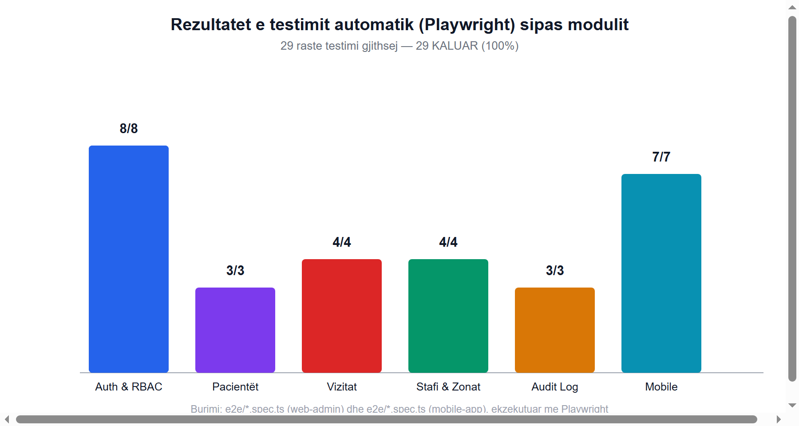
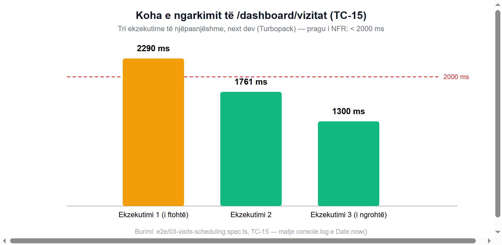

# Plan testimi, rezultatet dhe analiza

> Ky dokument përmbledh planin e testimit, rastet e testimit, rezultatet dhe analizën për
> **ViziTrack** (web-admin + mobile-app). Përputhet me Kapitullin 9 të punimit të diplomës;
> versioni i plotë me analizë të detajuar gjendet atje. Kodi burimor i testeve ndodhet te
> [`web-admin/e2e/`](../web-admin/e2e/) dhe [`mobile-app/e2e/`](../mobile-app/e2e/).

## Metodologjia

Testimi u krye në dy shtresa:

1. **Teste të automatizuara "end-to-end" (E2E)** me [Playwright](https://playwright.dev/) — 30
   raste testimi gjithsej, të ndara në 6 skedarë tematikë (5 për web-admin, 1 për mobile-app,
   i ekzekutuar kundër target-it web të Expo-s).
2. **Testim manual/eksplorues**, i dokumentuar me pamje ekrani direkt nga aplikacioni në punë
   (shih Kapitujt 6–8 të punimit të diplomës, dorëzuar veçmas si `.docx`), për rrjedha me
   ndërveprim vizual më kompleks (formulari me shumë hapa i krijimit të vizitës, formularët e
   shënimeve klinike sipas rolit).

Të gjitha testet u ekzekutuan kundër bazës reale të Supabase-it, e mbushur paraprakisht me **të
dhëna sintetike** (faker) dhe llogari testuese nën domain-in fiktiv `@demo.com` — asnjë e dhënë
reale identifikuese pacienti nuk u përdor apo u ekspozua gjatë testimit.

### Parakushtet — pa to, suita as nuk niset

Suita E2E **nuk riprodhohet nga një klon i thjeshtë i repository-t**. Kërkohen shprehimisht:

1. `.env.local` i konfiguruar në të dy aplikacionet (shih README-të përkatëse), duke përfshirë
   `TEST_USER_PASSWORD` — fjalëkalimin e llogarive sintetike `@demo.com`, i cili **nuk** është i
   koduar në kod dhe **nuk** commit-ohet te repository (lexohet nga mjedisi, shih `e2e/helpers.ts`
   dhe `mobile-app/e2e/mobile-screens.spec.ts`).
2. Projekti Supabase i lidhur duhet të jetë **aktiv** (jo i pauzuar — plani falas i Supabase-it
   pauzon automatikisht projektet pas ~7 ditësh pa aktivitet) dhe i mbushur me `zones`, `patients`,
   `visits`, `teams` sintetike dhe pesë llogaritë `@demo.com`, secila me `TEST_USER_PASSWORD` si
   fjalëkalim.

Pa këto dy kushte, `npm run test:e2e` / `npx playwright test` dështojnë që në hapin e kyçjes (ose
as nuk e nisin dev-serverin/build-in), jo për shkak të ndonjë defekti në kod.

### Mjedisi i ekzekutimit

| Komponenti | Vlera |
|---|---|
| Motori i testimit | `@playwright/test` v1.61.1, Chromium (headless) |
| web-admin | Next.js 16.2.10 (Turbopack), **ndërtim prodhimi** (`next build && next start`), porti 3000 |
| mobile-app | Expo SDK 57 (target web, react-native-web), Metro bundler, porti 8082 |
| Baza e të dhënave | Projekt real Supabase (PostgreSQL), me të dhëna sintetike |
| Llogaritë testuese | `admin@demo.com`, `dita@demo.com` (supervisor), `hasan/dardan/arta@demo.com` (mjek/infermier/laborant) |

Si të ekzekutosh vetë suitën (pasi parakushtet më sipër janë plotësuar):

```bash
cd web-admin && npm run test:e2e
cd mobile-app && npm run web &   # lëre të ekzekutohet paralelisht
cd mobile-app && npx playwright test
```

### Rastet me kusht (`test.skip`)

Tre thirrje `test.skip()`, të gjitha brenda `03-visits-scheduling.spec.ts`, i lidhin rastet me
gjendjen aktuale të të dhënave sintetike (të gjeneruara pjesërisht në mënyrë rastësore) — nëse
kushti nuk plotësohet, Playwright e raporton rastin si **SKIPPED**, jo si PASSED apo FAILED:

| Rasti | Rreshti | Kushti i skip-it |
|---|---|---|
| TC-13 | `03-visits-scheduling.spec.ts:45` | Asnjë ekip nuk operon në datën e zgjedhur rastësisht |
| TC-14 | `03-visits-scheduling.spec.ts:63` | Nuk u gjet asnjë vizitë ekzistuese për të testuar konfliktin |
| TC-14 | `03-visits-scheduling.spec.ts:89` | Ekipi i vizitës ekzistuese nuk ishte i zgjedhshëm në UI për atë datë |

Në ekzekutimin real të raportuar më poshtë, të tria kushtet u plotësuan dhe **asnjë rast nuk u
"skip"-ua** — të 30 rastet u ekzekutuan si teste të plota (jo të anashkaluara). Ky rezultat nuk
është i garantuar në çdo ekzekutim, pasi varet nga të dhënat e gjeneruara në atë moment.

## Rezultatet — përmbledhje



**30 nga 30 raste testimi KALOJNË** (asnjë e "skip"-uar) në gjendjen përfundimtare të kodit,
kundër mjedisit dhe parakushteve të përshkruara më sipër.

## Rastet e testimit

### web-admin (23 raste)

| ID | Skedari | Qëllimi i testit | Rezultati |
|---|---|---|---|
| TC-01 | `01-auth-rbac.spec.ts` | Admin hyn me sukses, sheh Qendrën Operacionale | KALOI |
| TC-02 | `01-auth-rbac.spec.ts` | Supervizor hyn me sukses, sheh Panelin Administrativ | KALOI |
| TC-03 | `01-auth-rbac.spec.ts` | Kredenciale të gabuara → mesazh gabimi, s'lejohet hyrje | KALOI |
| TC-04 | `01-auth-rbac.spec.ts` | I paautentikuar në `/admin` → ridrejtim te `/login` | KALOI |
| TC-05 | `01-auth-rbac.spec.ts` | I paautentikuar në `/dashboard` → ridrejtim te `/login` | KALOI |
| TC-06 | `01-auth-rbac.spec.ts` | Supervizor në `/admin` → ridrejtim te `/dashboard` (RBAC) | KALOI |
| TC-07 | `01-auth-rbac.spec.ts` | Punonjës terreni s'mund të hyjë në panelin web | KALOI |
| TC-08 | `01-auth-rbac.spec.ts` | Admin i kyçur → `/login` ridrejton te `/admin` | KALOI |
| TC-09 | `02-patients-privacy.spec.ts` | Lista e pacientëve identifikon vetëm me kod referimi | KALOI |
| TC-10 | `02-patients-privacy.spec.ts` | Filtrimi i pacientëve sipas zonës funksionon | KALOI |
| TC-11 | `02-patients-privacy.spec.ts` | Historiku i pacientit shfaqet saktë | KALOI |
| TC-12 | `03-visits-scheduling.spec.ts` | Lista e vizitave dhe filtrat e statusit funksionojnë | KALOI |
| TC-13 | `03-visits-scheduling.spec.ts` | Formulari i vizitës shfaq oraret e lira dinamikisht | KALOI |
| TC-14 | `03-visits-scheduling.spec.ts` | Ora e zënë shfaqet e çaktivizuar (parandalim konflikti) | KALOI¹ |
| TC-15 | `03-visits-scheduling.spec.ts` | Performanca e ngarkimit të `/dashboard/vizitat`, < 2000ms, kundër build-it të prodhimit | KALOI (shih grafikun më poshtë) |
| TC-23 | `03-visits-scheduling.spec.ts` | Dy kërkesa INSERT njëkohshme, i njëjti ekip/orar — vetëm njëra kalon (mbrojtje kundër garës, KF-03) | KALOI² |
| TC-16 | `04-staff-zones.spec.ts` | Faqja e stafit ndan administratorët nga stafi operativ | KALOI |
| TC-17 | `04-staff-zones.spec.ts` | Zonat listohen me veprime Ndrysho/Fshij | KALOI |
| TC-18 | `04-staff-zones.spec.ts` | Zonë me emër ekzistues refuzohet (validim unik) | KALOI |
| TC-19 | `04-staff-zones.spec.ts` | Profesioni klinik shfaqet për çdo punonjës terreni | KALOI |
| TC-20 | `05-audit-log.spec.ts` | Audit log shfaq etiketa INSERT/UPDATE/DELETE dhe diff | KALOI |
| TC-21 | `05-audit-log.spec.ts` | Audit log është vetëm-lexim (pa Fshij/Modifiko) | KALOI |
| TC-22 | `05-audit-log.spec.ts` | Supervizori s'ka qasje te `/admin/audit-logs` | KALOI |

¹ Shih [§ Gjetja kryesore](#gjetja-kryesore-defekti-i-zonës-kohore) — ky rast fillimisht zbuloi
një defekt real, i cili u korrigjua si pjesë e këtij punimi.

² Shih [§ Gjetja e dytë](#gjetja-e-dytë-dritarja-e-garës-te-krijovizite) — po ashtu zbuloi një
defekt real arkitekturor, i korrigjuar si pjesë e këtij punimi.

### mobile-app (7 raste)

| ID | Qëllimi i testit | Rezultati |
|---|---|---|
| TC-M01 | Ekrani i hyrjes mobil shfaqet me markën ViziTrack | KALOI |
| TC-M02 | Mjeku hyn dhe sheh Agjendën e ditës | KALOI |
| TC-M03 | "Historia" shfaq vizitat e përfunduara/anuluara | KALOI |
| TC-M04 | "Profili" shfaq të dhënat dhe rolin klinik | KALOI |
| TC-M05 | "Ndihma dhe Suporti" hap manualin dhe kontaktin IT | KALOI |
| TC-M06 | Laboranti hyn dhe sheh rolin e vet (Laborant) | KALOI |
| TC-M07 | Infermieri hyn dhe sheh rolin e vet (Infermier) | KALOI |

## Gjetja kryesore: defekti i zonës kohore

Gjatë hartimit të TC-14, u konstatua se `merrOraretEZena` (logjika e "orareve të lira" në
[`web-admin/src/app/dashboard/vizitat/actions.ts`](../web-admin/src/app/dashboard/vizitat/actions.ts))
llogariste kufijtë e ditës dhe formatonte orën e zënë duke u mbështetur **në zonën kohore të
vetë procesit të serverit**, jo në zonën kohore të biznesit (Kosovë). Në prodhim, mbi një
platformë "serverless" që ekzekuton në UTC (p.sh. Vercel), kjo do të kishte shkaktuar një
zhvendosje prej 1–2 orësh në kohën e ruajtur për çdo vizitë të re dhe do ta bënte kontrollin e
konfliktit të pabesueshëm — rrezik i vërtetë dyfish-rezervimi.

**Korrigjimi**: u shtua [`web-admin/src/utils/timezone.ts`](../web-admin/src/utils/timezone.ts),
i cili kryen çdo konvertim date/ore në mënyrë eksplicite për zonën `Europe/Belgrade`
(identifikuesi korrekt IANA për Kosovën — nuk ekziston një zonë e veçantë "Europe/Prishtina"),
i pavarur nga zona kohore e ambientit të ekzekutimit. Korrektësia u verifikua edhe me një
skript testimi i pavarur, duke krahasuar CET (dimër) dhe CEST (verë).

## Gjetja e dytë: dritarja e garës te `krijoVizite`

Gjatë rishikimit të pretendimit "kontrolli i konfliktit në databazë mbetet i vlefshëm edhe nëse
dy administratorë provojnë të planifikojnë të njëjtin ekip njëkohësisht" (kapitulli 6.3 i
punimit), leximi i imtësishëm i [`krijoVizite`](../web-admin/src/app/dashboard/vizitat/actions.ts)
zbuloi se ky pretendim **nuk ishte i vërtetë**: funksioni bën një `SELECT` (kontroll konflikti) e
më pas një `INSERT` të veçantë, pa asnjë kufizim (`constraint`) në databazë mes tyre. Dy kërkesa
të dërguara njëkohësisht për të njëjtin ekip/orar mund të kalonin që të dyja `SELECT`-in — asnjëra
nuk kishte bërë ende `INSERT` kur tjetra e lexoi gjendjen — duke lejuar dyfish-rezervim të
padetektuar (klasa e defekteve "time-of-check to time-of-use" / TOCTOU).

**Korrigjimi**: u shtua migrimi
[`supabase/migrations/20260929120000_visits_no_overlapping_team_bookings.sql`](../supabase/migrations/20260929120000_visits_no_overlapping_team_bookings.sql),
një `EXCLUDE CONSTRAINT` (PostgreSQL, `btree_gist`) mbi `(assigned_team_id, tstzrange(scheduled_start, scheduled_end))`
që e ndalon mbivendosjen **fizikisht, në nivel databaze** — pavarësisht sa kërkesa arrijnë
njëkohësisht — për vizitat jo të anuluara dhe jashtë kategorisë "Laborator" (i njëjti kusht që
zbaton tashmë kontrolli paraprak në nivel aplikacioni). `krijoVizite` kap tani edhe kodin e
gabimit `23P01` (`exclusion_violation`) dhe e kthen si mesazhin ekzistues "⚠️ Konflikt Orari",
si rrjetë e dytë sigurie. Korrektësia u verifikua me TC-23: dy `INSERT` konkurrentë, të nisur pa
pritur njëri-tjetrin, kundër së njëjtës vizitë sintetike — saktësisht njëri kalon, tjetri
refuzohet nga databaza me `23P01`.

## Matjet e performancës



Kërkesa jofunksionale (Kapitulli 3.5) kërkon kohë ngarkimi **nën 2000 ms** "në kushte normale
rrjeti". Matjet e mëparshme (kundër `next dev`) e tejkalonin këtë prag në ekzekutimin e parë "të
ftohtë" (2290 ms), për shkak të kompajlimit "just-in-time" të Turbopack-ut — jo tregues i
performancës reale të prodhimit. TC-15 dhe konfigurimi i suitës (`playwright.config.ts`) tani
ekzekutojnë kundër një ndërtimi prodhimi (`next build && next start`), ku çdo rrugë
parapërpilohet paraprakisht, dhe prag i vetëm prej 2000ms zbatohet drejtpërdrejt (jo një prag më
i lirshëm në kod).

## Vlerësimi i përdorshmërisë

Brenda fushëveprimit të këtij punimi nuk u organizua një studim formal përdorshmërie me
përdorues të jashtëm (shih kufizimin në Kapitullin 10). Në vend të kësaj u krye një vlerësim
heuristik nga autorja, duke aplikuar një nën-bashkësi të heuristikave të Nielsen-it — detajet e
plota gjenden në Kapitullin 9.6 të punimit.

## Kufizime të identifikuara gjatë testimit

- Vlerësimi i përdorshmërisë është heuristik, jo studim empirik me përdorues realë.
- Nuk ekziston integrim CI — ekzekutimi i testeve mbetet manual (shih rekomandimet, Kapitulli 10.3).
- Kufizimi i vetëm migrimit SQL të shtuar (`no_overlapping_team_visits`) është ende jashtë kodit
  të versionuar për pjesën tjetër të skemës (tabelat, politikat RLS, trigger-i i auditimit) —
  shih rekomandimin ekzistues në Kapitullin 10.3 për eksportimin e plotë të skemës.
